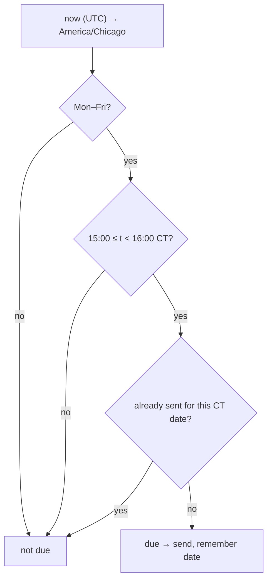

# daily_summary

Source: `src/daily_summary.rs` · New 2026-09-28 (user request). Wired in
`main.rs` (`send_daily_summary`, checked every loop tick); DB reads in
`db.rs` (`fetch_summary_rows`, `fetch_resolved_gate_rows`).

## When



## What

```
📊 [V2] DAILY SUMMARY — 2026-09-29 · MES

ml-model
Today : 1 — ✅1 ❌0 ⏱0 🚫0 open 0 · 100% · +51.0t $+63.75
Week  : 1 — ✅1 ❌0 ⏱0 🚫0 open 0 · 100% · +51.0t $+63.75
Total : 5 (1W/4L) 20% · exp -2.6t · $-16.25 · need 15 more · ❌ not live
…one block per strategy (ml-model, fade-poc, fade-poc-fill)…

Gate: 20+ trades, win ≥ 35%, exp ≥ 5.0t, P&L ≥ $100
```
(real output, 2026-09-29)

- **Scope**: only contracts of the roots this process trades — `SYMBOLS`
  mapped through `bilore_core::instrument::futures_root` (MES only since
  2026-09-29). Old MNQ rows stay in the DB, just not counted.
- **Today / Week**: rows with that `session_date` / Monday..today
  (`week_start`) — won / lost / expired / invalidated / open
  (pending+entered), win rate over won+lost (`–` if none), P&L of
  resolved rows only. One DB read (`db::fetch_summary_rows`) feeds both.
- **Total**: cumulative won/lost via `bilore_backtest::gate`
  (`group_by_strategy` + `compute_gates` + `TRUST_CFG`), same MES scope as
  `bilore-backtest-gate`'s default `GATE_ROOTS`, so both always agree.
  `needed == 0` but still failing → "❌ not live — below the bar".

## Notes

- One-hour window: a monitor down at 15:00 still sends once it's back
  before 16:00; a restart later that evening does not send a stale one.
- `last_summary` is in memory — a restart *inside* the window re-sends.
- Trades still open at 15:00 show under "open" — they keep running and
  are marked `expired` at the midnight-CT rollover if nothing resolves
  them. `expired`/`invalidated` never count toward the gate line.
- DB error → that day's summary is skipped and logged, never sent wrong.
