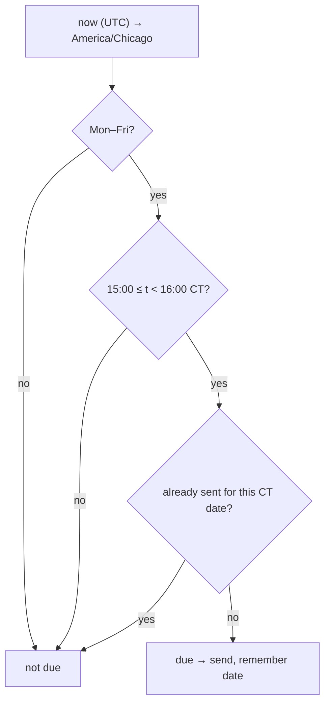

# daily_summary

Source: `src/daily_summary.rs` · New 2026-09-28 (user request). Wired in
`main.rs` (`send_daily_summary`, checked every loop tick); DB reads in
`db.rs` (`fetch_day_rows`, `fetch_resolved_gate_rows`).

## When



## What

```
📊 [V2] DAILY SUMMARY — 2026-09-28

ml-model
Today : 4 — ✅1 ❌1 ⏱0 🚫1 open 1 · +16.0t $+20.00
Total : 3 (1W/2L) 33% · exp -0.0t · $+0.00 · need 17 more · ❌ not live
…one block per strategy (ml-model, fade-poc, fade-poc-fill)…

Gate: 20+ trades, win ≥ 35%, exp ≥ 5.0t, P&L ≥ $100
```

- **Today**: every `shadow_trades_v2` row with that `session_date` —
  won / lost / expired / invalidated / open (pending+entered); P&L sums
  resolved rows only. All symbols together (dollars already per-symbol).
- **Total**: cumulative won/lost via `bilore_backtest::gate`
  (`group_by_strategy` + `compute_gates` + `TRUST_CFG`) — the exact code
  behind `bilore-backtest-gate`, so both always agree. `needed == 0` but
  still failing → "❌ not live — below the bar".

## Notes

- One-hour window: a monitor down at 15:00 still sends once it's back
  before 16:00; a restart later that evening does not send a stale one.
- `last_summary` is in memory — a restart *inside* the window re-sends.
- Trades still open at 15:00 show under "open" — they keep running and
  are marked `expired` at the midnight-CT rollover if nothing resolves
  them. `expired`/`invalidated` never count toward the gate line.
- DB error → that day's summary is skipped and logged, never sent wrong.
