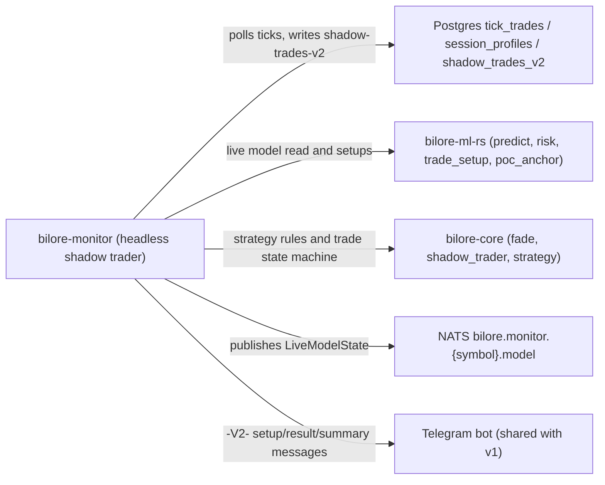
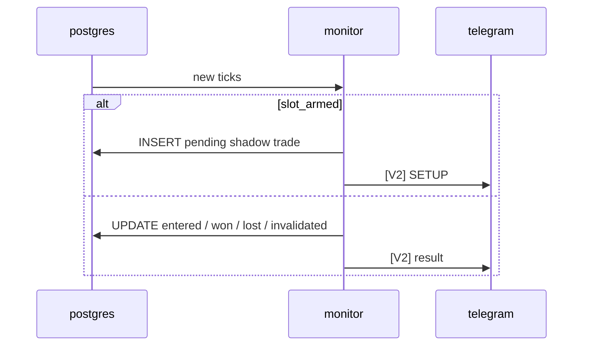

<!-- GENERATED BY DECISIONSPEC v0.1 — DO NOT EDIT. Edit specs/*.spec instead. -->
# Decision Index

_Generated by `decispec index` — do not edit._

## Model — specs/000-decisions.spec

| Container | Title |
| --- | --- |
| postgres | Postgres tick_trades / session_profiles / shadow_trades_v2 |
| monitor | bilore-monitor (headless shadow trader) |
| ml_rs | bilore-ml-rs (predict, risk, trade_setup, poc_anchor) |
| core | bilore-core (fade, shadow_trader, strategy) |
| nats | NATS bilore.monitor.{symbol}.model |
| telegram | Telegram bot (shared with v1) |

### Flow: tick_to_shadow_trade

## MON-001 — The monitor runs v1's real pipeline live in shadow mode, retrained at start and every Chicago day rollover, instead of trusting its backtests

**Status:** proposed

**Context:** Built 2026-09-08 after daily_plans was found orphaned since 2026-06-18. Two backtests of the faithful Rust port came back at 76.3% and 74.1% win rate (after two look-ahead fixes), well above v1's real forward record of 61.3%, and could not be verified clean; the decision was to trust forward-only live results and run the port in shadow mode. The model retrains from load_periods at start and on every CT day rollover, keeping yesterday's model if a retrain fails (v1's 'retrain every run' convention).

**Consequences:** + live results no backtest bug can taint. - evidence accrues only at market speed. - training still reads the DB tables bilore-ml-rs found ~70% wrong before September 2026 (ML-004). - main.rs wiring is untested.

### Requirements

| ID | Requirement |
| --- | --- |
| MON-001-R1 | WHEN the Chicago date rolls over THEN the monitor SHALL retrain the model from load_periods and SHALL keep the previous model if retraining fails |

### Scenarios

| ID | Requirement | Layer | Scenario |
| --- | --- | --- | --- |
| day_rollover_retrains_and_keeps_old_model_on_failure | MON-001-R1 | unit | Given a trained model and a failing load_periods, when the CT date rolls over, then the previous model is still used. |

## MON-002 — Each strategy owns one slot: one open shadow trade at a time, re-armed as soon as it resolves or a pending setup is invalidated, with no daily cap

**Status:** accepted

**Context:** User rules (2026-09/10): re-arm immediately, no daily cap. A pending setup is invalidated when the strategy's direction flips past the 4-tick buffer (FADE_FLIP_BUFFER_TICKS, default 4) so chop at the POC does not cancel and re-lock every few ticks; an entered trade is only ended by its stop or target.

**Consequences:** + a strategy can take several trades a day, each recorded. + a stale direction never fills. - more trades per day means faster but noisier trust evidence.

### Requirements

| ID | Requirement |
| --- | --- |
| MON-002-R1 | WHEN a strategy's trade resolves (won, lost or expired) THEN its slot SHALL hand the trade back and be armed for the next setup |
| MON-002-R2 | WHEN the direction flips past the flip buffer THEN a pending trade SHALL be invalidated and the slot re-armed, while an entered trade SHALL keep the slot locked |

### Scenarios

| ID | Requirement | Layer | Scenario |
| --- | --- | --- | --- |
| a_won_trade_frees_the_slot_for_the_next_setup | MON-002-R1 | unit | Given a slot holding a Won trade, when take_resolved runs, then the trade is handed back, the slot is armed and the next tick is evaluated fresh. |
| lost_and_expired_trades_free_the_slot_too | MON-002-R1 | unit | Given slots holding a Lost and an Expired trade, when take_resolved runs, then each slot is armed. |
| an_open_trade_keeps_the_slot_busy | MON-002-R1 | unit | Given a slot with an open trade, when is_armed is checked, then false. |
| an_empty_slot_is_armed_and_has_nothing_to_take | MON-002-R1 | unit | Given an empty slot, when is_armed and take_resolved run, then armed, nothing to take. |
| a_direction_flip_hands_back_the_invalidated_trade_and_re_arms_the_slot | MON-002-R2 | unit | Given a slot with pending Short trade 7, when invalidate_on_direction_flip sees Long, then trade 7 comes back Invalidated and the slot is armed. |
| an_entered_trade_keeps_the_slot_locked_on_a_flip | MON-002-R2 | unit | Given a slot with an Entered Short, when invalidate_on_direction_flip sees Long, then nothing is invalidated and the slot stays locked. |
| the_same_direction_leaves_the_slot_untouched | MON-002-R2 | unit | Given a slot with a pending Short, when invalidate_on_direction_flip sees Short, then nothing changes. |
| an_empty_slot_has_nothing_to_invalidate | MON-002-R2 | unit | Given an empty slot, when invalidate_on_direction_flip runs, then None. |
| flip_buffer_ticks_defaults_to_4_and_rejects_bad_values | MON-002-R2 | unit | Given FADE_FLIP_BUFFER_TICKS unset, negative or unparsable, when flip_buffer_ticks runs, then 4. |

## MON-003 — A level that stopped a strategy out is not re-taken in the same direction, and the block survives a restart

**Status:** accepted

**Context:** User rule (2026-09/10, simulated first in bilore-ml-rs 404a7c9): after a stop, the same level in the same direction is not taken again; a retest from the other side is a different trade. Won and expired trades block nothing. Stopped levels are rebuilt from shadow_trades_v2 at start so a restart cannot reopen them. Applies to fade-poc, fade-poc-globex and fade-roll-*.

**Consequences:** + no revenge entries at a level that just failed. - a level that fails once is out for the rest of its session even if conditions change.

### Requirements

| ID | Requirement |
| --- | --- |
| MON-003-R1 | WHEN a trade is stopped out THEN the same strategy SHALL not take the same entry level in the same direction again, and SHALL still take the other direction or another level |
| MON-003-R2 | WHEN the monitor restarts THEN stopped levels SHALL be restored per strategy from shadow_trades_v2, ignoring rows with an unknown direction |

### Scenarios

| ID | Requirement | Layer | Scenario |
| --- | --- | --- | --- |
| a_stopped_out_trade_blocks_the_same_direction_at_the_same_entry | MON-003-R1 | unit | Given a Short stopped out at 5812.25, when is_blocked is checked, then Short 5812.25 blocked; Long 5812.25 and Short 5815.00 allowed. |
| a_winning_or_expired_trade_blocks_nothing | MON-003-R1 | unit | Given a Won and an Expired trade at 5812.25, when is_blocked is checked for Short 5812.25, then not blocked. |
| a_level_stopped_out_this_session_is_not_retaken_in_that_direction | MON-003-R1 | unit | Given a fade-poc-globex level stopped out this session, when globex_setup is computed again, then that level in that direction is skipped. |
| a_stopped_level_is_not_retaken_in_the_same_direction | MON-003-R1 | unit | Given a fade-roll level stopped out, when the rolling setup is computed again, then that level in that direction is skipped. |
| stopped_levels_restored_from_the_db_block_after_a_restart | MON-003-R2 | unit | Given stopped rows fade-poc Short 7747.75, ml-model Long 7731, fade-poc Sideways, when stopped_levels_by_strategy runs, then fade-poc blocks Short 7747.75, ml-model Long 7731, the Sideways row is ignored. |

## MON-004 — On restart the monitor restores each strategy's newest open trade and replays the day's ticks without ever generating a setup from replayed ticks

**Status:** accepted

**Context:** The monitor is restarted by the bilore launcher whenever its binary is rebuilt (2026-10-02). Restoring from shadow_trades_v2 keeps one trade per slot; a restored trade only sees ticks from its signal instant on; setups may only fire on ticks at or after the live start, so catching up never fabricates trades.

**Consequences:** + restarts mid-session are safe for the record. - a setup that would have fired during downtime is never taken.

### Requirements

| ID | Requirement |
| --- | --- |
| MON-004-R1 | WHEN the monitor restarts THEN it SHALL restore only the newest pending or entered trade per strategy, and SHALL not restore resolved or malformed rows |
| MON-004-R2 | WHEN ticks older than the live start are replayed THEN they SHALL never generate a setup, and a restored trade SHALL ignore ticks from before its signal instant |

### Scenarios

| ID | Requirement | Layer | Scenario |
| --- | --- | --- | --- |
| only_the_newest_open_trade_per_strategy_is_restored | MON-004-R1 | unit | Given rows ml-model 9 and 5 (entered) and fade-poc 8 (pending), newest first, when restore_slots runs, then ml-model restores 9 and fade-poc 8; two slots. |
| a_pending_row_restores_as_pending_still_waiting_for_its_fill | MON-004-R1 | unit | Given a pending row, when restore_open_trade runs, then a Pending trade with no fill. |
| an_entered_row_restores_as_an_entered_trade_with_its_fill | MON-004-R1 | unit | Given an entered row with a fill price, when restore_open_trade runs, then an Entered trade with that fill. |
| resolved_or_malformed_rows_are_not_restored | MON-004-R1 | unit | Given won/lost rows and malformed rows, when restore_open_trade runs, then None. |
| replayed_ticks_never_generate_setups | MON-004-R2 | unit | Given live start 15:00:00 UTC, when may_signal checks 14:59:59 and 15:00:00, then false then true. |
| a_trade_ignores_ticks_from_before_it_existed | MON-004-R2 | unit | Given a restored trade whose signal instant is 14:30 UTC, when sees runs for 14:00 and 14:30, then false then true (the signal instant itself counts). |

## MON-005 — The prior RTH levels the strategies trade against are rebuilt from recorded 08:30-15:00 CT ticks, not read from session_profiles

**Status:** accepted

**Context:** 2026-10-02: tpo-builder's RTH session had no end, so the session_profiles row absorbed post-close and early-Globex trades. 10-01 true RTH POC/VAH/VAL 7690/7723.25/7677.25; the row read 7730/7739/7693.50 by evening, and the RTH strategies load it at midnight. Ticks are recorded all session (tick_recorder watchdog, 09-30), so levels.rs builds the profile itself, like the tick backtests. tpo-builder was fixed the same day (TPO-001) and repair_session_profiles corrected the stored rows.

**Consequences:** + the live strategies use exactly the backtested profile. - a session not fully recorded yields no levels (the strategy sits out) rather than wrong ones.

### Requirements

| ID | Requirement |
| --- | --- |
| MON-005-R1 | WHEN prior RTH levels are built THEN they SHALL come from ticks between 08:30 and 15:00 CT, and SHALL be None unless the recording spans the whole session |

### Scenarios

| ID | Requirement | Layer | Scenario |
| --- | --- | --- | --- |
| a_fully_recorded_session_gives_its_poc_and_value_area | MON-005-R1 | unit | Given ticks recorded from 08:30 to 14:59 CT, when levels::rth_levels_from_ticks runs, then it returns that session's POC, VAH and VAL. |
| a_partly_recorded_session_is_not_trusted | MON-005-R1 | unit | Given a recording starting 09:10, and one stopping 13:00, when rth_levels_from_ticks runs, then None for both. |
| no_ticks_no_levels | MON-005-R1 | unit | Given no ticks, when rth_levels_from_ticks runs, then None. |

## MON-006 — fade-poc-globex fades toward the just-finished RTH POC during Globex with the backtested geometry: entry 6 ticks past VAH/VAL, 60-tick stop, 2R target, no model gate

**Status:** accepted

**Context:** 2026-09-30: live rule = backtested rule (bilore-ml-rs backtest_poc_geometry, Globex GA). Short above the POC entering at VAH + 6 ticks, Long at or below entering at VAL - 6 ticks; stop and target from poc_anchor::apply_geometry. Globex hours (17:00-08:30 CT) belong to the NEXT trading day, Friday evening to Monday.

**Consequences:** + its own scoreboard (slug fade-poc-globex) independent of the RTH strategies. - a 60-tick stop is $75 per MES contract. - far from every level there is no setup.

### Requirements

| ID | Requirement |
| --- | --- |
| MON-006-R1 | WHEN price is above the prior RTH POC during Globex THEN globex_setup SHALL sell at VAH + 6 ticks with a 60-tick stop and a 2R target, and below or at it SHALL buy at VAL - 6 ticks |
| MON-006-R2 | WHEN a Globex timestamp is mapped THEN globex_session SHALL return the next trading day, and None during RTH and the 16:00-17:00 CT halt |

### Scenarios

| ID | Requirement | Layer | Scenario |
| --- | --- | --- | --- |
| above_the_poc_it_sells_at_the_vah_with_a_60_tick_stop_and_2r_target | MON-006-R1 | unit | Given price 7740 above the prior POC, when globex::globex_setup runs, then Short at VAH 7746.50 (VAH + 6 ticks), stop 7761.50, target 7716.50. |
| below_the_poc_it_buys_at_the_val | MON-006-R1 | unit | Given price 7728 below the prior POC, when globex_setup runs, then Long at 7721.25 (VAL - 6 ticks), stop 7706.25, target 7751.25. |
| far_above_every_level_there_is_no_setup | MON-006-R1 | unit | Given price far above every prior level, when globex_setup runs, then None. |
| globex_hours_map_to_the_next_trading_day | MON-006-R2 | unit | Given Tue 20:00, Wed 03:00, Fri 18:00, Wed 10:00 and 16:30 CT, when globex_session runs, then Wed, Wed, Mon, None (RTH), None (halt). |

## MON-007 — fade-roll-* replicate the user's own style with rolling levels: fade toward the POC of the last 16 completed 30-min periods, one strategy per trading window

**Status:** accepted

**Context:** 2026-10-02, from the user's 09-28..10-02 fills. Windows (CT): evening 17:00-02:00 and overnight 02:00-08:30 at 48-tick stop / 1R, RTH 08:30-15:00 at 40 ticks / 0.75R. N=16 was best or near-best in every window of bilore-ml-rs backtest_rolling_levels; only overnight was positive there (+2.3 ticks/trade, both halves). The window is continuous across sessions and resets after a 3h+ gap. Evening trades are stored under the next trading day.

**Consequences:** + each window has its own scoreboard, so the overnight edge is not diluted. - evening and RTH were not positive in the backtest; they run to gather forward evidence.

### Requirements

| ID | Requirement |
| --- | --- |
| MON-007-R1 | WHEN a time is classified THEN window_of SHALL return Evening for 17:00-02:00, Overnight for 02:00-08:30, Rth for 08:30-15:00 CT and None for 15:00-17:00 |
| MON-007-R2 | WHEN rolling levels are snapshotted THEN only completed 30-min periods SHALL count, merged over the last N, and a gap of 3 hours or more SHALL reset the window |
| MON-007-R3 | WHEN price is above the rolling POC THEN the setup SHALL sell at the nearest rolling level above, and above the rolling value area at the rolling high |

### Scenarios

| ID | Requirement | Layer | Scenario |
| --- | --- | --- | --- |
| windows_split_the_day_at_17_02_08_30_and_15 | MON-007-R1 | unit | Given 17:00, 01:59, 02:00, 08:29, 08:30, 14:59, 15:00 and 16:59 CT, when rolling::window_of runs, then Evening, Evening, Overnight, Overnight, Rth, Rth, None, None. |
| the_three_strategies_use_16_periods_and_their_geometry | MON-007-R1 | unit | Given rolling::configs(), when it is inspected, then all use 16 periods; the second is Overnight; RTH is 40 ticks / 0.75R. |
| evening_trades_are_stored_under_the_next_trading_day | MON-007-R1 | unit | Given an evening-window trade, when its trading date is computed, then it is the next trading day. |
| only_completed_periods_count | MON-007-R2 | unit | Given a tick at 20:05 CT, then one at 20:31, when snapshot(1) runs after each, then None while 20:00 is open; then POC/high/low 100.00; snapshot(2) None. |
| the_snapshot_merges_the_last_n_periods_with_their_high_and_low | MON-007-R2 | unit | Given several completed periods, when snapshot(n) runs, then the last n periods are merged into one profile with their high and low. |
| a_gap_of_three_hours_or_more_resets_the_window | MON-007-R2 | unit | Given Friday 15:55/16:00 ticks, then Sunday 17:00, when snapshot(1) runs after Sunday's tick, then None: the weekend gap started a fresh window. |
| above_the_rolling_poc_it_sells_at_the_nearest_level_above | MON-007-R3 | unit | Given price above the rolling POC, when the rolling setup is computed, then a Short at the nearest rolling level above. |
| above_the_value_area_the_rolling_high_is_the_entry | MON-007-R3 | unit | Given price above the rolling value area, when the rolling setup is computed, then the entry is the rolling high. |

## MON-008 — A daily Telegram summary is sent once per weekday in the hour after the 15:00 CT close, per strategy, with the same gate code as bilore-backtest-gate

**Status:** superseded

**Superseded by:** `MON-012`

**Context:** User request 2026-09-28. Due 15:00-16:00 CT on the Chicago wall clock (survives DST); a late restart sends nothing stale. Per strategy: today's and this week's (Monday..today) trades, win rate, P&L, and the cumulative go-live gate line computed with bilore_backtest::gate so the two reports can never disagree.

**Consequences:** + one glance per day at every scoreboard. - a monitor down for the whole hour skips that day's summary.

### Requirements

| ID | Requirement |
| --- | --- |
| MON-008-R1 | WHEN the Chicago time is between 15:00 and 16:00 on a weekday and today's summary was not sent THEN summary_due SHALL return today; otherwise None |
| MON-008-R2 | WHEN the summary is built THEN each strategy SHALL show today's rows, Monday-to-today rows and the cumulative gate line |

### Scenarios

| ID | Requirement | Layer | Scenario |
| --- | --- | --- | --- |
| due_right_at_the_rth_close_on_a_weekday | MON-008-R1 | unit | Given Monday 2026-09-28 15:00 CT, nothing sent, when daily_summary::summary_due runs, then 2026-09-28. |
| not_due_before_the_close | MON-008-R1 | unit | Given a weekday before 15:00 CT, when summary_due runs, then None. |
| not_due_after_the_one_hour_window | MON-008-R1 | unit | Given 16:00 CT, nothing sent, when summary_due runs, then None. |
| not_due_on_weekends | MON-008-R1 | unit | Given a Saturday at 15:00 CT, when summary_due runs, then None. |
| not_due_twice_the_same_day | MON-008-R1 | unit | Given today's summary already sent, when summary_due runs at 15:30 CT, then None. |
| uses_chicago_wall_clock_after_dst_ends | MON-008-R1 | unit | Given 2026-12-01 (CST) at 15:00 and 14:30 CT, when summary_due runs, then due at 15:00, not at 14:30. |
| today_line_counts_only_todays_rows | MON-008-R2 | unit | Given rows from today and earlier, when the today line is built, then only today's rows count. |
| week_line_covers_monday_through_today_and_excludes_last_week | MON-008-R2 | unit | Given rows from this week and last week, when the week line is built, then only Monday through today count. |
| total_line_shows_the_cumulative_gate | MON-008-R2 | unit | Given a strategy's resolved history, when the summary is built, then the total line shows the gate result. |
| a_strategy_with_no_trades_says_so_for_today_and_week | MON-008-R2 | unit | Given a strategy with no rows, when the summary is built, then today and week say no trades. |

## MON-009 — Tick size and value come from the contract root's real CME spec; an unrecognized root falls back to MES

**Status:** accepted

**Context:** Found live: MNQZ6 shadow trades were computing PnL and max-loss at MES's $1.25/tick instead of MNQ's $0.50 (2.5x overstatement). economics.rs matches an explicit root prefix, not trailing-character stripping, because CME month codes overlap root letters (MNQ's Q is August).

**Consequences:** + P&L is right for MES, MNQ and MGC. - an unlisted root (e.g. NQ, $5/tick) silently gets MES economics; with MES-only trading (BT-002) this is latent, not live.

### Requirements

| ID | Requirement |
| --- | --- |
| MON-009-R1 | WHEN tick economics are looked up THEN MES SHALL be 0.25/$1.25, MNQ 0.25/$0.50, MGC its own spec, and an unrecognized root SHALL get MES's |

### Scenarios

| ID | Requirement | Layer | Scenario |
| --- | --- | --- | --- |
| mes_contract_has_1_25_tick_value | MON-009-R1 | unit | Given MESZ6, when economics::tick_economics runs, then tick 0.25, value $1.25. |
| mnq_contract_has_the_distinct_0_50_tick_value | MON-009-R1 | unit | Given MNQZ6, when tick_economics runs, then value $0.50. |
| mgc_contract_has_its_own_tick_size_and_value | MON-009-R1 | unit | Given an MGC contract, when tick_economics runs, then MGC's tick size and value. |
| unrecognized_root_falls_back_to_mes_economics | MON-009-R1 | unit | Given NQZ6, when tick_economics runs, then 0.25 / $1.25. |

## MON-010 — v2 alerts share v1's Telegram bot but are prefixed [V2], and use local sounds that never overlap v1's

**Status:** accepted

**Context:** telegram.rs reuses TELEGRAM_BOT_TOKEN/TELEGRAM_CHAT_ID from bilore-ml/.env so one chat carries both streams; the [V2] prefix tells them apart. sound.rs mirrors morning_prep.py's _alert_zone with entirely different afplay sounds (v1 uses Funk, Glass, Hero, Ping), so a v2 alert is recognisable by ear.

**Consequences:** + no second bot to manage. - both streams interleave in one chat. - sounds are macOS-only (afplay).

### Requirements

| ID | Requirement |
| --- | --- |
| MON-010-R1 | WHEN a shadow-trade result message is built THEN it SHALL start with [V2] and name the strategy, symbol, direction, prices and P&L |
| MON-010-R2 | WHEN an alert sound is chosen THEN it SHALL be distinct per alert kind and never one of v1's Funk, Glass, Hero or Ping |

### Scenarios

| ID | Requirement | Layer | Scenario |
| --- | --- | --- | --- |
| result_message_shows_won_outcome_and_pnl | MON-010-R1 | unit | Given a Won trade, when the result message is built, then it shows the outcome and P&L. |
| result_message_shows_lost_outcome | MON-010-R1 | unit | Given a Lost trade, when the result message is built, then it shows the Lost outcome. |
| no_sound_here_overlaps_v1s_set | MON-010-R2 | unit | Given every v2 AlertKind, when sounds_for runs, then no path ends in Funk, Glass, Hero or Ping .aiff. |
| every_alert_kind_maps_to_a_distinct_primary_sound | MON-010-R2 | unit | Given every AlertKind, when sounds_for runs, then each kind's primary sound differs. |

## MON-011 — Manual-trading alert: one Telegram message when price leaves the value area of a normally shaped developing profile and at least 2 of structure, order flow and the other timeframe agree with the fade back toward its POC

**Status:** accepted

**Context:** User request 2026-10-07, for manual trading (not a shadow strategy, places nothing). The profile is the CURRENT session's developing volume profile (RTH from 08:30 CT, Globex from 17:00 CT). It must be a normal shape: D (bell), P or b; irregular profiles (double distribution, thin/elongated) never alert. Price above VAH means fade SHORT, below VAL fade LONG. Factors, each checked against the fade direction: structure (5-min bars of the session, pivot_n 3), order flow (session cumulative delta, directional at |delta| >= 500, the confirmation gate), and the other timeframe for that session type (bilore-core participant_view over the prior 1, 5 and 20 sessions' composite of the same type, RTH or Globex). Alert when at least 2 of the 3 agree (user: '2 or 3 align'). At most one alert per profile period (30 min RTH, 60 min Globex) unless price has crossed the POC since the last alert. The message shows the alignment and a text profile with VAH/POC/VAL and the price (user chose text over an image). Shape thresholds are initial values, to be checked against real alerts: classify only after 2 completed periods; double distribution = a second 1-point peak of at least 50% of the POC peak with a valley of at most 25% between them; elongated = value area wider than 75% of the range; D/P/b by the POC's third of the range.

**Consequences:** + a high-quality, rate-limited prompt for the user's own fade trades. - the other-timeframe read leans WITH price outside composite value, so at the upper value area it often disagrees with a short fade: that is the data, not a bug. - the composites come from tpo_bars, whose pre-2026-10-02 RTH rows include post-close trades. - not blocked by SYS-006's volatility block (it is information, not an entry), but the message says when a block is on. - shape thresholds are untested on real profiles.

### Requirements

| ID | Requirement |
| --- | --- |
| MON-011-R1 | WHEN the monitor receives a live trade THEN it SHALL add it to the developing profile of its session, RTH 08:30-15:00 CT or Globex 17:00-08:30 CT, which restarts empty at each session start; trades between 15:00 and 17:00 CT belong to no session |
| MON-011-R2 | WHEN the profile has at least 2 completed periods THEN it SHALL be classified D, P or b by its POC's third of the range, or Irregular when it has a double distribution or a value area wider than 75% of its range; before that it SHALL not be classified |
| MON-011-R3 | WHEN price is above VAH or below VAL of a D, P or b profile THEN the fade direction SHALL be SHORT or LONG respectively; inside the value area or on an irregular profile there SHALL be no alert |
| MON-011-R4 | WHEN at least 2 of structure, order flow and the other timeframe agree with the fade direction THEN the alert SHALL fire; a neutral or unavailable factor SHALL not count |
| MON-011-R5 | WHEN an alert was sent in the current profile period THEN no other SHALL be sent in that period unless price has crossed the POC since; a new period SHALL allow a new alert |
| MON-011-R6 | WHEN the alert is sent THEN the message SHALL show the side, fade direction, shape, each factor's read, VAH/POC/VAL and a text profile of at most 24 rows marking VAH, POC, VAL and the price |

### Scenarios

| ID | Requirement | Layer | Scenario |
| --- | --- | --- | --- |
| session_of_maps_rth_globex_and_the_gap | MON-011-R1 | unit | Given Monday 08:30, 14:59, 15:00, 16:59, 17:00 and Tuesday 02:00 CT, and Saturday noon, when va_alert::session_of runs, then RTH, RTH, none, none, Globex (Monday 17:00), the same Globex session, none. |
| the_profile_restarts_at_each_session_start | MON-011-R1 | unit | Given RTH trades on Monday, then a Globex trade at 17:00, when the developing profile is read after the Globex trade, then it holds only the Globex trade. |
| a_bell_shaped_profile_is_d | MON-011-R2 | unit | Given a symmetric profile with its POC mid-range, when classify_shape runs, then D. |
| a_profile_with_its_poc_in_the_upper_third_is_p | MON-011-R2 | unit | Given volume concentrated near the top with a thin lower tail, when classify_shape runs, then P. |
| a_profile_with_its_poc_in_the_lower_third_is_b | MON-011-R2 | unit | Given volume concentrated near the bottom with a thin upper tail, when classify_shape runs, then b. |
| a_double_distribution_is_irregular | MON-011-R2 | unit | Given two volume peaks of similar size separated by a thin valley, when classify_shape runs, then Irregular. |
| a_thin_elongated_profile_is_irregular | MON-011-R2 | unit | Given volume spread evenly over the range (value area > 75% of it), when classify_shape runs, then Irregular. |
| too_early_in_the_session_is_not_classified | MON-011-R2 | unit | Given a bell-shaped profile with only 1 completed period, when the alert is evaluated, then no shape and no alert. |
| price_above_vah_fades_short | MON-011-R3 | unit | Given a D profile and price above VAH with 2 factors agreeing SHORT, when evaluate runs, then an Upper alert fading SHORT. |
| price_below_val_fades_long | MON-011-R3 | unit | Given a D profile and price below VAL with 2 factors agreeing LONG, when evaluate runs, then a Lower alert fading LONG. |
| price_inside_the_value_area_never_alerts | MON-011-R3 | unit | Given a D profile, price between VAL and VAH, all factors agreeing, when evaluate runs, then no alert. |
| an_irregular_profile_never_alerts | MON-011-R3 | unit | Given a double distribution with price above VAH and all factors agreeing, when evaluate runs, then no alert. |
| two_of_three_agreeing_with_the_fade_alerts | MON-011-R4 | unit | Given price above VAH, structure bearish, delta -800, other timeframe leaning Long, when evaluate runs, then an alert with 2 of 3 agreeing. |
| one_of_three_does_not_alert | MON-011-R4 | unit | Given price above VAH, structure bearish, delta +800, other timeframe leaning Long, when evaluate runs, then no alert. |
| neutral_factors_do_not_count | MON-011-R4 | unit | Given price above VAH, structure bearish, delta -300 (under the gate), no composite, when evaluate runs, then no alert: only 1 factor agrees. |
| one_alert_per_period | MON-011-R5 | unit | Given an alert sent in RTH period C, when the conditions hold again later in period C without a POC cross, then nothing is sent. |
| a_poc_cross_re_arms_within_the_period | MON-011-R5 | unit | Given an alert sent above VAH in period C, then price trades through the POC, when price goes back above VAH in period C with the conditions met, then a second alert is sent. |
| a_new_period_re_arms | MON-011-R5 | unit | Given an alert sent in period C, when the conditions hold in period D, then a new alert is sent. |
| the_text_profile_marks_vah_poc_val_and_price | MON-011-R6 | unit | Given a profile with VAH, POC, VAL and price on different rows, when render_profile runs, then the rows carry VAH, POC, VAL markers and the price arrow, highest price first. |
| the_text_profile_fits_in_24_rows | MON-011-R6 | unit | Given a 60-point range at 0.25 ticks (240 levels), when render_profile runs, then it uses at most 24 rows. |
| va_alert_message_shows_alignment_and_profile | MON-011-R6 | unit | Given an Upper SHORT alert on a P profile with structure and order flow agreeing, when telegram::va_alert_message runs, then it shows '[V2] VALUE AREA — MESZ6', 'above VAH', 'fade SHORT', 'P', 2/3 aligned, each factor and the profile block. |

## MON-012 — Telegram carries only won/lost shadow-trade results and the value-area alert

**Status:** accepted

**Context:** User, 2026-10-07: remove the useless Telegram alerts. Setup, invalidated and expired messages, the volatility block notices (SYS-006, now logged only) and the daily summary (MON-008) are no longer sent; sounds stay. v1's bilore_session.py alerts are untouched.

**Consequences:** + a quiet chat where every message is a finished trade or a manual-trading prompt. - pending setups and volatility blocks are visible only in the logs and the cockpit. - the daily summary code stays in the repo, unused, until removed on request.

### Requirements

| ID | Requirement |
| --- | --- |
| MON-012-R1 | WHEN a shadow trade ends THEN its result SHALL go to Telegram only if it is Won or Lost |

### Scenarios

| ID | Requirement | Layer | Scenario |
| --- | --- | --- | --- |
| only_won_and_lost_results_go_to_telegram | MON-012-R1 | unit | Given trades ending Won, Lost, Expired, Invalidated and Skipped, when result_goes_to_telegram runs for each, then true for Won and Lost only. |

