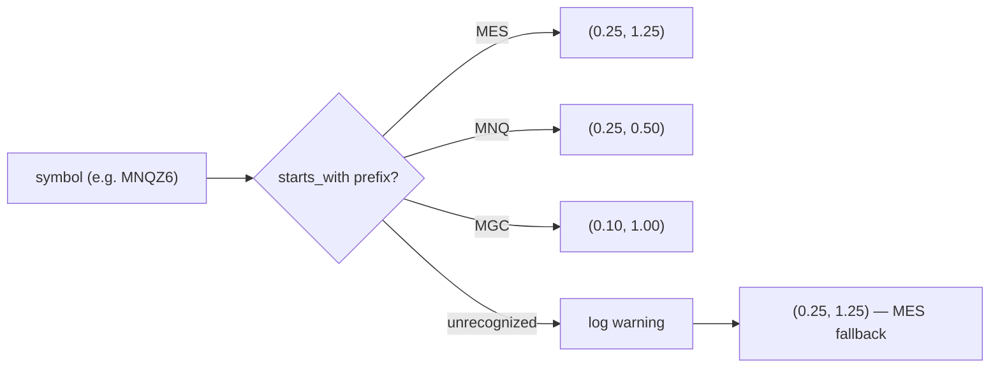

# economics module

## What it is

Per-symbol tick economics (tick size, tick value in USD) — pure and
tested. Fixes a real live bug found 2026-09-22: `main.rs` used to hardcode
MES's economics (`$0.25`/`$1.25`) for every registered symbol, so
MNQZ6's shadow trades were computing PnL and max-loss-dollars at 2.5x its
real `$0.50`/tick value.

## Function index

| Function | Signature | Purpose |
|---|---|---|
| `tick_economics` | `(symbol: &str) -> (Decimal, Decimal)` | `(tick_size, tick_value_usd)` for one micro-futures contract, matched by root prefix. Unrecognized roots fall back to MES's economics with a warning log — only skews *displayed* shadow-trade PnL/risk, never a real order, so a wrong-but-visible number is acceptable rather than refusing to track a new symbol. |

## Why prefix matching, not trimming trailing month/year characters

CME month codes (F/G/H/J/K/M/N/Q/U/V/X/Z) overlap with real contract root
letters — `MNQ`'s own trailing `Q` is also August's month code. A generic
"strip trailing month+year chars" trim over-strips `MNQZ6` down to `MN`.
Explicit `starts_with` prefix matching has no such ambiguity and was
verified against this exact case
(`mnq_contract_has_the_distinct_0_50_tick_value`).

## Status

done (2026-09-22) — `PerSymbolState` now carries its own `tick_size`/
`tick_value`, set once in `init_symbol_state` via this function, replacing
the module-level MES-only constants `main.rs` used everywhere (the
`shadow_trader::on_price` PnL call, and both `risk_params` calls in
`try_signal`/`try_fade_signal`, converted to `f64` via `ToPrimitive`).
