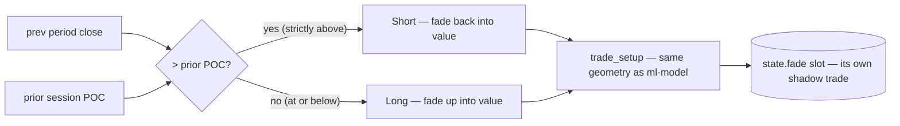

# fade module

## What it is

The `fade-poc` shadow strategy's decision rule — pure and tested, the only
logic in `bilore-monitor` that decides trade direction differently from the
ML pipeline. Origin: model-analysis.md §6.10 — with real tick-verified
fills, the model's direction showed no skill (20.0% vs random's 17.4%),
but fade-toward-POC was the only profitable variant tested (58.3%, +146
ticks, small sample — a lead, not an edge) while its exact mirror went
0/23.

## Function index

| Function | Signature | Purpose |
|---|---|---|
| `fade_direction` | `(price: Decimal, prior_poc: Decimal) -> Direction` | Short when price is strictly above the prior POC, Long otherwise. Mirrors `backtest_tick_sim_direction.rs`'s fade arm exactly (`row.open > row.prior_poc`), including equality going Long. |
| `fade_trust` | `(price: Decimal, prior_poc: Decimal, stop_distance: Decimal) -> f64` | Entry trust 0.5–1.0: extension beyond the prior POC relative to the stop distance, mapped onto `[0.5, 1.0]`. 50% = at the POC (coin-flip boundary), 100% = a full stop beyond. A normalized score, not a calibrated win probability (contracts/strategies.md, "Trust metric"). Degenerate stop distance → neutral 0.5. |

## Entry trust

`fade-poc`'s per-entry trust (2026-09-19) is the POC-extension score:
how far price has pushed beyond the prior POC relative to the setup's
stop distance, `0.5 + 0.5 × clamp01(|close − prior POC| / stop_dist)`.
Rationale: the backtest's fade edge driver was extension beyond the POC
(model-analysis.md §6.10), and right at the POC the direction rule is a
coin flip — so trust starts at 50% there and scales up with extension.
It is persisted to `shadow_trades_v2.confidence`, published as
`LiveModelState.entry_trust`, shown as `Trust: NN%` in the SETUP and
result Telegram messages, and displayed in the cockpit's Risk / Trade
Setup panel. Semantics are per strategy and NOT cross-strategy
calibrated — see `bilore-project-conf/contracts/strategies.md`, "Trust
metric", which is the authority.

## Deliberate scope (what is NOT here)

- **Risk sizing** — the fade arm in the validated backtest still used the
  trained model's `risk_params`; the live path does the same (see
  `main.rs::try_fade_signal`). Only direction selection differs.
- **The live-vs-backtest deviation** — the backtest evaluated every period;
  live locks at most one fade trade per session (monitor convention).
  Documented in `bilore-project-conf/contracts/strategies.md`.
- **Persistence/alerts** — live in `main.rs`/`db.rs`/`telegram.rs`, tagged
  `strategy = "fade-poc"` (`bilore_core::strategy::FADE_POC`).

## Status

done (2026-09-18) — added to validate model-analysis.md §6.10 live, in
parallel with `ml-model`, with per-strategy attribution in
`shadow_trades_v2`.
