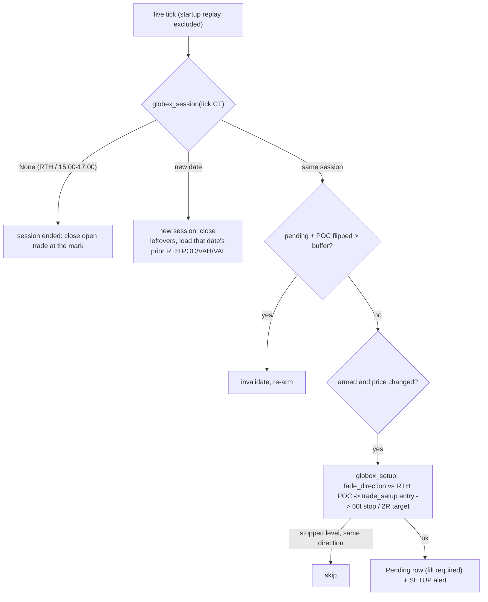

# globex

Source: `src/globex.rs` (pure) · wired in `main.rs` (`try_globex_signal`, the
per-tick Globex block) · New 2026-09-30. Strategy `fade-poc-globex` —
registered in `bilore-project-conf/contracts/strategies.md`.

## Rule

| Function | Contract | Tests |
|---|---|---|
| `globex_session(now_ct)` | Trading date of the Globex session (17:00 -> next trading day, Fri -> Mon); `None` in RTH and 15:00-17:00 | `globex_hours_map_to_the_next_trading_day` |
| `globex_setup(price, prior, stopped, cfg)` | Fade direction vs prior RTH POC, live `trade_setup` entry, `poc_anchor::apply_geometry` 60t/2R; blocked if that (direction, entry) was stopped this session | `above_the_poc_it_sells_at_the_vah_with_a_60_tick_stop_and_2r_target`, `below_the_poc_it_buys_at_the_val`, `a_level_stopped_out_this_session_is_not_retaken_in_that_direction`, `far_above_every_level_there_is_no_setup` |

## Notes

- The Globex slot is independent of the CT-midnight rollover; its session
  ends at 08:30 (`close_at_mark`: exit + P&L at that tick).
- Restart: open trades and stopped levels restored from rows under the
  current Globex session's date; a trade left open across a downtime that
  spans 08:30 is closed at the mark on the first live tick.
- Not shown in the cockpit's Risk/Trade Setup panel (it lists the three RTH
  strategies); Telegram SETUP alerts carry a 🌙 and the daily summary
  includes it.
