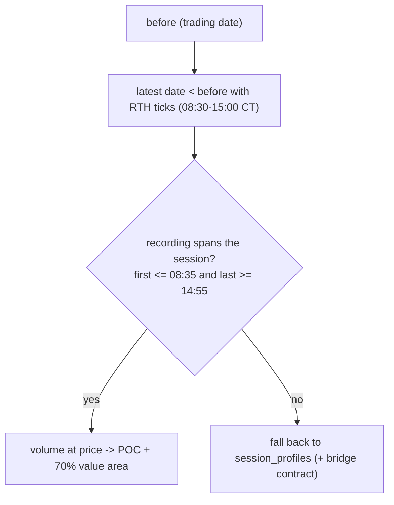

# levels

Source: `src/levels.rs` (pure) + `db::last_rth_volume_profile` (I/O) · New
2026-10-02. Used by `main.rs`'s `fetch_prior_session` for every strategy.

| Function | Contract | Tests |
|---|---|---|
| `rth_levels_from_ticks(rows, first, last)` | POC/VAH/VAL from volume at price; `None` if partly recorded or empty | `a_fully_recorded_session_gives_its_poc_and_value_area`, `a_partly_recorded_session_is_not_trusted`, `no_ticks_no_levels` |

Why not `session_profiles`: tpo-builder's RTH session has no end, so its
live row includes post-close and early-Globex trading until 19:00 CT
(10-01: true POC 7690 vs row 7730).
