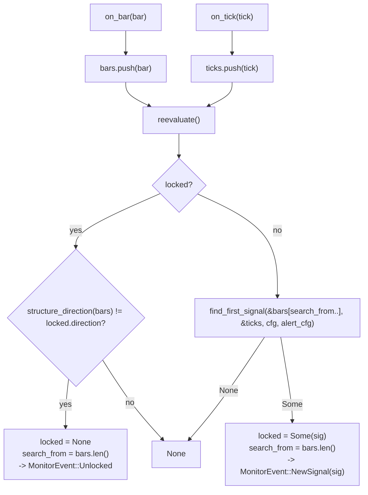

# live_signal

Source: `src/live_signal.rs` · New in v2 — streaming wrapper around
`bilore-backtest::signal::find_first_signal` (already validated there),
adapted so `main.rs`'s polling loop can feed it bars/ticks one at a time
instead of batch-replaying a whole historical session.

## Pipeline

## Why `search_from` exists

Found live 2026-09-08 while writing the "unlock on bias flip" test: without
it, unlocking immediately re-triggers `find_first_signal` over the WHOLE
accumulated `bars` array from index 0 — which just re-finds the SAME
already-passed signal that originally locked, since `find_first_signal`
always looks for the first directional bias from the start of whatever
slice it's given (correct for a one-shot historical replay, wrong for a
continuously-growing live array). `search_from` is advanced to the current
length every time a signal locks OR unlocks, so a fresh scan only ever
considers bars added since that point.

## Function index

| Symbol | Purpose | Tests |
|---|---|---|
| `LiveMonitor::on_bar()` / `on_tick()` | Append + `reevaluate()` | `no_event_with_too_few_bars`, `emits_new_signal_once_enough_bars_confirm_a_bias` |
| `LiveMonitor::reevaluate()` (private) | Lock/unlock state machine described above | `stays_locked_and_emits_nothing_further_while_bias_holds`, `unlocks_when_the_bias_flips` |
| `LiveMonitor::reset_for_new_day()` | Clears bars/ticks/lock/search_from — `main.rs` calls this (by reconstructing a fresh `LiveMonitor`, not this method directly, so `scan_start_ts` can also be recomputed for the new day) on CT calendar rollover | `reset_for_new_day_clears_everything` |
| `LiveMonitor::locked_signal()` | Current locked signal, if any | (exercised by the above) |

## Known deviations / scope notes

- One locked signal per session, matching v1's "lock the first valid
  setup; unlock only if lean direction flips" (`rth_monitor.py`/
  `bilore_session.py`) — not an exhaustive multi-signal-per-day scanner.
- Unlocking does NOT auto-close an already-entered shadow trade — v1
  doesn't either (a trade tracks to its own stop/target regardless of a
  later lean flip); `main.rs` only prevents starting a SECOND trade while
  one is still open, matching v1's one-trade-per-session behavior.
