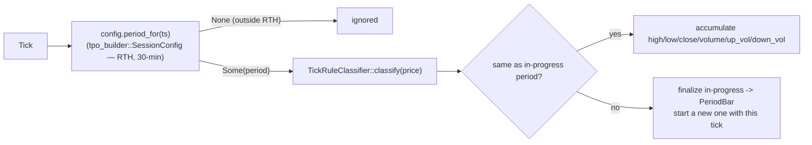

# period_agg

Source: `src/period_agg.rs` · New in v2 (2026-09-08) — the live-tick
equivalent of what `period_profiles`/`historical_bars`'s `bar_delta` CTE
give `bilore-ml-rs` in batch. Needed because `bilore_core::bar_builder::
BarBuilder` only tracks high/low/close (no open, no volume, no aggressor
side) — not enough for `bilore_ml_rs::predict::LivePeriodInput`'s
`prev_bullish`/`prev_range`/`prev_volume`/`prev_delta_ratio` features,
which need a genuine 30-min-period OHLCV+order-flow bar.

## Pipeline

## Function index

| Symbol | Purpose | Tests |
|---|---|---|
| `PeriodAggregator::on_tick()` | Accumulate or finalize+start, per the diagram above | `first_tick_starts_period_a_with_no_completed_bar_yet`, `ticks_within_the_same_period_accumulate_ohlv`, `up_and_down_volume_follow_the_tick_rule`, `ticks_outside_rth_are_ignored` |
| `PeriodAggregator::current_period_idx()` | The still-forming period's index, if any | (exercised above) |
| `PeriodAggregator::reset()` | Clears in-progress state — `main.rs` calls this (via reconstructing a fresh aggregator) on CT day rollover | `reset_clears_in_progress_state` |

## Known scope notes

- RTH only (`tpo_builder::rth_session_config()`) — overnight/Globex ticks
  are silently ignored, matching v1's period-model scope (no overnight
  period letters in `period_profiles`).
- Owns its own `TickRuleClassifier` — a fresh one per aggregator instance,
  so the tick-rule's "first tick is always Buy" carry-forward state resets
  cleanly on day rollover along with everything else.
