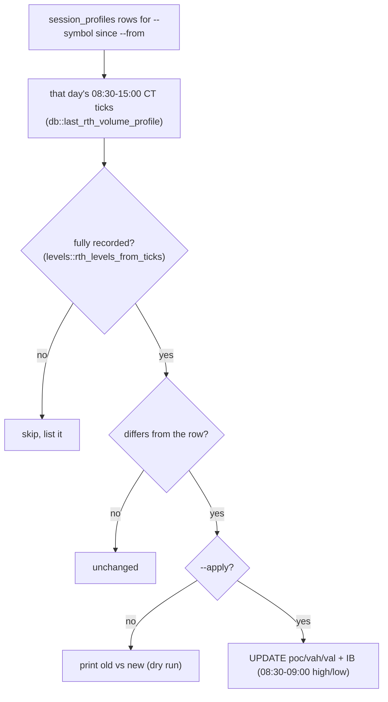

# repair_session_profiles

Source: `src/bin/repair_session_profiles.rs` · One-off data repair, 2026-10-02.

tpo-builder's RTH session had no end until `baf159b`, so each live
`session_profiles` row absorbed post-close and early-Globex trades until
19:00 CT. This rebuilds the rows from recorded ticks.

Run 2026-10-02 on MESZ6 from 2026-09-15: 13 rows repaired (10-01 POC
7730 -> 7690; the rest moved by 0.25-3 points at the value-area edges),
2026-09-23 skipped (not fully recorded). A second dry run reports 0 changes.
Uses the same profile code as the live strategies, so stored and live levels
agree. `MESZ6-GLOBEX` rows are not covered: overnight ticks are only
complete since the recorder watchdog (2026-09-30).
