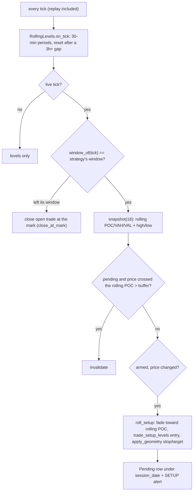

# rolling

Source: `src/rolling.rs` (pure) · wired in `main.rs` (`try_roll_signal`, the
per-tick `fade-roll-*` block) · New 2026-10-02. Strategies `fade-roll-evening`,
`fade-roll-overnight`, `fade-roll-rth` — registered in
`bilore-project-conf/contracts/strategies.md`.

The user's own style (their 09-28..10-02 ES fills: fades at the overnight
extremes and value edges, ~6-point targets, tight risk) with ROLLING levels
from the last 16 completed 30-min periods, one strategy per trading window.

| Strategy | Window (CT) | Geometry | Backtest (1-min bars, N=16) |
|---|---|---|---|
| `fade-roll-evening` | 17:00-02:00 | 48t / 1R | -1.8 t/trade (loses for every N) |
| `fade-roll-overnight` | 02:00-08:30 | 48t / 1R | +2.3 t/trade, both halves positive (inside the bars' ~3t error) |
| `fade-roll-rth` | 08:30-15:00 | 40t / 0.75R | -1.2 t/trade (loses for every N) |

| Function | Contract | Tests |
|---|---|---|
| `window_of(t)` | Evening 17:00-02:00, Overnight 02:00-08:30, RTH 08:30-15:00, else `None` | `windows_split_the_day_at_17_02_08_30_and_15` |
| `session_date(ct)` | Globex trading date (17:00 -> next trading day) for Evening/Overnight, calendar date for RTH | `evening_trades_are_stored_under_the_next_trading_day` |
| `RollingLevels::{on_tick, snapshot}` | Completed periods only; last N merged (POC/VA + high/low); 3h+ gap resets | `only_completed_periods_count`, `the_snapshot_merges_the_last_n_periods_with_their_high_and_low`, `a_gap_of_three_hours_or_more_resets_the_window` |
| `roll_setup(...)` | Fade toward rolling POC; levels POC/VAH/VAL/Roll High/Roll Low; geometry; no re-take | `above_the_rolling_poc_it_sells_at_the_nearest_level_above`, `above_the_value_area_the_rolling_high_is_the_entry`, `a_stopped_level_is_not_retaken_in_the_same_direction` |
| `configs()` | N = 16; 48t/1R Globex, 40t/0.75R RTH | `the_three_strategies_use_16_periods_and_their_geometry` |

Restart: the open trade of the window in progress is restored; open rows from
windows that ended while the monitor was down are expired at startup.
