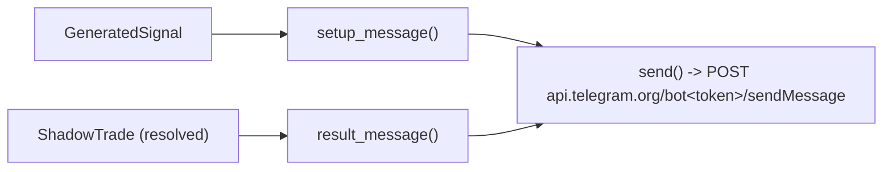

# telegram

Source: `src/telegram.rs` · New in v2 — `[V2]`-prefixed alerts on the same
bot/chat as v1's `telegram_notify.py` (`TELEGRAM_BOT_TOKEN`/
`TELEGRAM_CHAT_ID`, reused from `bilore-ml/.env`, not duplicated), so both
streams land in one chat and can be told apart at a glance. Message
builders are pure and tested; `send()` is a thin, untested HTTP wrapper —
same I/O-vs-logic split as every other crate here.

## Pipeline

## Function index

| Symbol | Purpose | Tests |
|---|---|---|
| `setup_message()` | Direction/entry/stop/target + whether order_flow also confirmed | `setup_message_includes_symbol_direction_and_prices`, `setup_message_shows_confirmed_state` |
| `result_message()` | Won/Lost/Expired icon + entry/exit/PnL | `result_message_shows_won_outcome_and_pnl`, `result_message_shows_lost_outcome` |
| `send()` | POSTs to the Telegram Bot API, HTML parse mode (matches v1's convention) | not tested — network I/O |

## Known deviations / scope notes

- Not a port of `telegram_notify.py` — that file has ~10 message types
  (setup, zone alert, shadow result, daily summary, family broadcast...);
  this only covers the two v2 actually needs right now (setup + result).
  Extend if the comparison needs more (e.g. a daily summary) later.
- If `TELEGRAM_BOT_TOKEN`/`TELEGRAM_CHAT_ID` aren't set, `main.rs` logs the
  message instead of sending — doesn't fail the monitor over a missing
  Telegram config.
