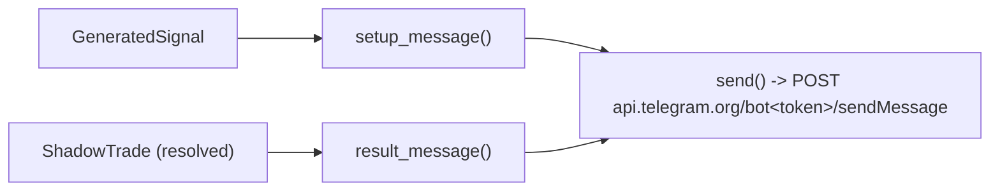

# telegram

Source: `src/telegram.rs` · New in v2 — `[V2]`-prefixed alerts on the same
bot/chat as v1's `telegram_notify.py` (`TELEGRAM_BOT_TOKEN`/
`TELEGRAM_CHAT_ID`, reused from `bilore-ml/.env`, not duplicated), so both
streams land in one chat and can be told apart at a glance. Message
builders are pure and tested; `send()` is a thin, untested HTTP wrapper —
same I/O-vs-logic split as every other crate here.

## Pipeline

```mermaid
flowchart LR
    Sig["GeneratedSignal"] --> SM["setup_message()"]
    Trade["ShadowTrade (resolved)"] --> RM["result_message()"]
    SM --> Send["send() -> POST api.telegram.org/bot&lt;token&gt;/sendMessage"]
    RM --> Send
```

## Function index

| Symbol | Purpose | Tests |
|---|---|---|
| `setup_message()` | Direction/entry/stop/target + whether order_flow also confirmed | `setup_message_includes_symbol_direction_and_prices`, `setup_message_shows_confirmed_state` |
| `invalidated_message()` | 🚫 `[V2][strategy] INVALIDATED` + direction + entry "(never filled)" + why — pending setup cancelled on a direction flip (2026-09-25) | `invalidated_message_names_the_setup_and_why_it_was_cancelled` |
| `result_message()` | Won/Lost/Expired icon + entry/exit + entry trust (`Trust: NN%` — the 0..1 score captured at lock time, same value persisted to `shadow_trades_v2.confidence`; semantics per strategy, contracts/strategies.md "Trust metric") + PnL | `result_message_shows_won_outcome_and_pnl`, `result_message_shows_lost_outcome` |
| `volatility_started_message()` | ⚠️ `[V2] VOLATILITY` — no new setups: reason (release name / RTH open / Globex reopen / spike Nx the normal 30-second move) and until when (bilore-specs SYS-006, 2026-10-04) | `volatility_message_names_the_reason_and_when_it_ends` |
| `volatility_over_message()` | ✅ `[V2] VOLATILITY OVER` — new setups allowed again, naming what ended | `volatility_over_message_says_setups_are_allowed_again` |
| `va_alert_message()` | 📊 `[V2] VALUE AREA` — side, fade direction, shape, period, each factor's read (✅/❌/➖), VAH/POC/VAL and the text profile in `<pre>` (MON-011, 2026-10-07) | `va_alert_message_shows_alignment_and_profile` |
| `send()` | POSTs to the Telegram Bot API, HTML parse mode (matches v1's convention) | not tested — network I/O |

## Known deviations / scope notes

- **Since 2026-10-07 (MON-012) only won/lost results, the value-area alert and (from
  2026-10-08, MON-008) the daily summary are sent.** Setup, invalidated and expired
  messages and the volatility notices are built but logged, not sent; their builders stay
  tested. One summary on demand: `bilore-monitor --send-summary [YYYY-MM-DD]`.

- Not a port of `telegram_notify.py` — that file has ~10 message types
  (setup, zone alert, shadow result, daily summary, family broadcast...);
  this only covers the two v2 actually needs right now (setup + result).
  Extend if the comparison needs more (e.g. a daily summary) later.
- If `TELEGRAM_BOT_TOKEN`/`TELEGRAM_CHAT_ID` aren't set, `main.rs` logs the
  message instead of sending — doesn't fail the monitor over a missing
  Telegram config.
