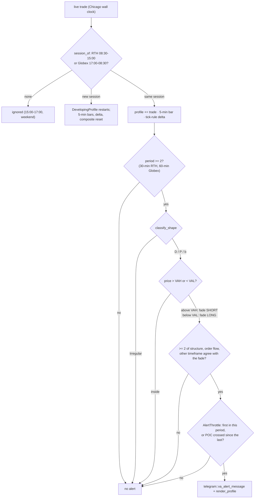

# va_alert

Source: `src/va_alert.rs` · New 2026-10-07, user request (MON-011). A manual-trading
prompt, not a shadow strategy: it places and records nothing, it only sends one Telegram
message when the fade back into value looks supported.

## Decision

## Inputs (main.rs `VaState`)

| Factor | Read | Agrees when |
|---|---|---|
| Structure | `analyze_structure` over the session's 5-min bars, pivot_n 3 | bias direction = fade |
| Order flow | session cumulative tick-rule delta | `order_flow_check(delta, fade)` confirms (\|Δ\| ≥ 500) |
| Other timeframe | `participant_view` over the prior 1/5/20 sessions' `tpo_bars` composite of the same type (`MESZ6` / `MESZ6-GLOBEX`) | lean = fade |

## Shape (first-pass thresholds)

- Classified only after 2 completed periods.
- **Irregular** when the value area spans more than 65% of the range (elongated: a flat
  profile's spans ~70%, a bell's ~40%), or when, on the profile smoothed over 5 points,
  a second local peak of at least 40% of the main one, at least 20% of the range away,
  has a valley of at most half its height between them (double distribution).
- Otherwise **P** (POC in the upper third), **b** (lower third) or **D**.

Raw 1-point buckets were tried first and rejected: real profiles are jagged at that
resolution and the normal 2026-10-06 RTH profile read irregular all day. Measured on 16
RTH sessions, about 35% of hourly snapshots read double and 15% elongated. A replay of
2026-09-30..10-07 would have sent 8 alerts, about one per session.

## Function index

| Symbol | Purpose | Tests |
|---|---|---|
| `session_of()` / `period_of()` | Session and profile period at a Chicago time | `session_of_maps_rth_globex_and_the_gap`, `periods_are_30_minutes_in_rth_and_60_in_globex` |
| `DevelopingProfile::on_trade()` | Session profile, restarts each session | `the_profile_restarts_at_each_session_start` |
| `classify_shape()` | D / P / b / Irregular | `a_bell_shaped_profile_is_d`, `a_profile_with_its_poc_in_the_upper_third_is_p`, `a_profile_with_its_poc_in_the_lower_third_is_b`, `a_double_distribution_is_irregular`, `a_thin_elongated_profile_is_irregular` |
| `evaluate()` | All MON-011 conditions except the throttle | `too_early_in_the_session_is_not_classified`, `price_above_vah_fades_short`, `price_below_val_fades_long`, `price_inside_the_value_area_never_alerts`, `an_irregular_profile_never_alerts`, `two_of_three_agreeing_with_the_fade_alerts`, `one_of_three_does_not_alert`, `neutral_factors_do_not_count` |
| `AlertThrottle` | One per period unless the POC was crossed | `one_alert_per_period`, `a_poc_cross_re_arms_within_the_period`, `a_new_period_re_arms` |
| `render_profile()` | Text profile, ≤ 24 rows of round size, VAH/POC/VAL and ◀ price | `the_text_profile_marks_vah_poc_val_and_price`, `the_text_profile_fits_in_24_rows` |

## Known deviations / scope notes

- The other timeframe leans WITH price outside composite value, so above VAH it often
  disagrees with a short fade; that is the data.
- Composites come from `tpo_bars`, whose pre-2026-10-02 RTH rows include post-close trades.
- Not silenced by the SYS-006 volatility block (it is information, not an entry); the
  message adds a line when a block is on.
- Price one tick outside the value area already counts.
