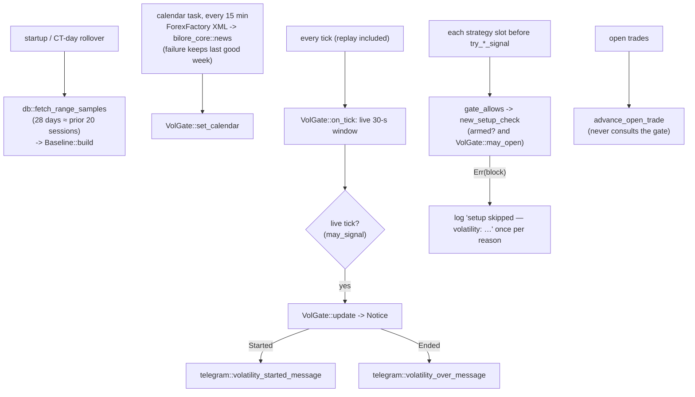

# vol_gate

Source: `src/vol_gate.rs` · New 2026-10-04, user decision. Wires bilore-core's
`volatility` rule (bilore-specs `SYS-006`) into the monitor: one `VolGate` per symbol
(`PerSymbolState.vol`), fed every tick, consulted before ANY strategy creates a new
setup, and turned into one Telegram message when a block starts and one when it ends.

## Wiring (main.rs)

All strategies go through `gate_allows`: `ml-model`, `fade-poc`, `fade-poc-fill`,
`fade-poc-globex`, `fade-roll-*`. Pending setups still fill and open trades keep their
stop and target (user, 2026-10-04): `advance_open_trade` takes no gate on purpose.

## Function index

| Symbol | Purpose | Tests |
|---|---|---|
| `VolGate::on_tick()` / `may_open()` | Feed the spike window with the baseline normal; Ok or the block | `a_quiet_gate_allows_new_setups`, `ticks_feed_the_spike_check_with_the_baseline_normal` |
| `VolGate::update()` | One notice per block start/end; a spike extension or ratio change is not a new block; a change of reason is a new start | `a_release_block_is_announced_with_its_end_time`, `a_block_is_announced_once_even_when_extended`, `the_end_of_a_block_is_announced`, `when_a_release_ends_inside_a_spike_the_spike_is_announced` |
| `VolGate::set_calendar()` / `calendar_unavailable()` | Calendar missing: entries continue, reported | `a_missing_calendar_is_reported_and_entries_continue`, `a_calendar_loaded_later_takes_effect` |
| `main.rs` `new_setup_check()` | Armed slot + gate -> may create | `no_new_setup_during_a_block`, `an_armed_slot_may_create_a_setup_when_quiet`, `a_busy_slot_creates_nothing_with_or_without_a_block` |
| `main.rs` `advance_open_trade()` | Fill/stop/target, gate-free | `pending_setup_still_fills_during_a_block`, `open_position_still_exits_during_a_block` |

## Known deviations / scope notes

- Notices go out on live ticks only, so a restart's replay never re-sends old ones; a
  restart in the middle of a block announces it again once.
- The calendar is fetched by the monitor itself (same feed and parser as the cockpit's
  panel). Until the first successful fetch, a warning is logged every 15 minutes and
  release windows don't apply.
- An ml-model setup skipped at a period close waits for the next period close.
